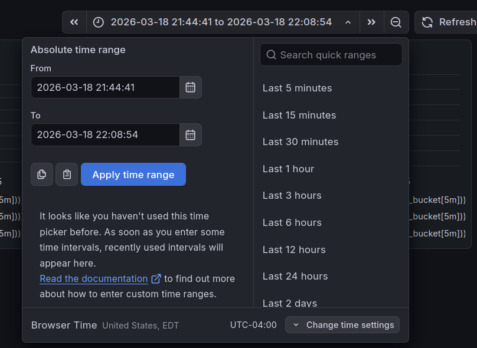

# monitoring-stack

A small experiment repository demonstrating how to simulate an LLM token-streaming service with OpenTelemetry metrics (TTFT + TPS) and how to deploy a local monitoring stack (Prometheus, Grafana, Loki, Tempo, and OpenTelemetry Collector).

---

## Application Setup to emit traces

### 1) Setup Python environment (uv + venv)

This repo uses **uv** for dependency management (via `uv.lock`). Ensure you are running in a Python 3.10+ environment.

```bash
uv venv
source .venv/bin/activate
uv sync
```

### 2) Run the notebook

Open `otel_simulation.ipynb` in Jupyter and run the cells in order.

The notebook demonstrates:
- How to simulate a multi-service trace (frontend → gateway → backend → LLM service)
- How to calculate TTFT (Time to First Token) and TPS (Tokens Per Second) in a streaming scenario
- How to export traces + metrics via OTLP (default collector: `http://localhost:4317`)

> ✅ Tip: If you don’t have an OTEL collector running, the notebook still runs, but traces/metrics are no-ops.

---

## Monitoring Stack Setup (Helm Charts)

This repo includes Helm charts to deploy a full monitoring stack.

Before installing helm charts, you need to have dhi-io-secret configured in kubernetes to pull the images

```bash
kubectl create secret docker-registry dhi-io-secret \  
  --docker-server=dhi.io \  
  --docker-username=<your email> \  
  --docker-password=<your dhi token>\  
  --docker-email=<your email>   
```

### 1) Start SeaweedFS (used as S3 for Loki)

```bash
cd seaweedFS
docker run -d \
  -p 9333:9333 \
  -p 9332:8080 \
  -p 8333:8333 \
  -v $(pwd)/data:/data \
  -v $(pwd)/s3.conf:/etc/seaweedfs/s3.conf \
  chrislusf/seaweedfs \
  server -dir=/data -volume.max=5 -s3 -s3.config=/etc/seaweedfs/s3.conf
```

Create the required buckets (refer to .bru if required)

```bash
curl -X PUT http://localhost:8333/loki-ruler
curl -X PUT http://localhost:8333/loki-chunks
curl -X PUT http://localhost:8333/loki-admin
curl -X PUT http://localhost:8333/tempo-traces
```

### 2) Install the Helm charts (example)

```bash
helm install prom ./prometheus -f prometheus-values.yaml
helm install tempo ./tempo-distributed -f tempo-values.yaml
helm install loki ./loki -f loki-values-seaweed.yaml
helm install otel-collector ./opentelemetry-collector -f otel-collector-values.yaml
helm install grafana ./grafana -f grafana-values.yaml
```

> ⚠️ If you are using a private container registry, create a Kubernetes image pull secret and update the chart values accordingly.

### 3) Port forward the otel grpc port (4317) to your localhost so the app can publish traces to localhost:4317

```bash
kubectl port-forward svc/otel-collector-opentelemetry-collector 4317:4317
```

---

## 🔍 Verification

### 1) Verifying that Otel-Collector is publishing metrics  
Port forward the otel /metrics endpoint to localhost:9464/metrics  

```bash
kubectl port-forward svc/otel-collector-opentelemetry-collector  9464:9464
```

You should see something like the following:  
llm_tokens_generated_total{...} 23  
llm_ttft_milliseconds_bucket{...} 0  
llm_tokens_per_second_per_second_bucket{...} 0  


### 2) Verifying that the metrics are reaching Prometheus

Port forward the prometheus UI to the localhost:3111  
```bash
kubectl port-forward svc/prom-prometheus-server 3111:80
```
1. Enter the UI. Check that Prometheus can scrape from OTEL:  
Go under Status > Target Health.  
Should see otel-collector configured with endpoint http://otel-collector-opentelemetry-collector.default.svc.cluster.local:9464/metrics and state is UP  

2. Go to the Query tab and type "llm"  
The llm related metrics should appear.  
  
You can key in the following to see the values over 5 minutes at the 95th percentile (p95)  
- 95th percentile (p95) means that 95% of the requests return before this time, and only 5% of requests take slower than that time  

```promql
histogram_quantile(
  0.95,
  sum by (le) (rate(llm_tokens_per_second_per_second_bucket[5m]))
)
```

### 3) Viewing in Grafana  

1. Port forward grafana to localhost:3000
```bash
kubectl port-forward svc/grafana 3000:80
```

2. Get Grafana login password:
```bash
kubectl get secret --namespace default grafana -o jsonpath="{.data.admin-password}" | base64 --decode ; echo
```

3. Navigate to localhost:3000 and login
user: admin
password: <from Step 2>

4. Left Nav Bar > Dashboards > New > Import
Drag and drop the dashboard under dashboard/gaia-system-monitoring.json

5. While running the notebook, wait about 5min
Configure the time interval to "Last 15 mins" and dashboard will refresh
